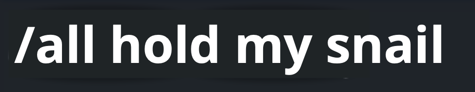

<a name="readme-top"></a>


<!-- PROJECT LOGO -->
<br />
<div align="center">
  <a href="">
    
  </a>

<h2 align="center">unSwear</h3>

  <p align="center">
    Fixing Toxicity by replacing curse words! 
    <br />
    <br />
  </p>
</div>


## About The Project

This repo contains a simple python script that listens for words and then replaces them based on the file `replacements.csv`.

You can add new words here, separated by comma.


## How to set up? 

Since I don't have any Windows device available right now, and most of the people playing LoL play it on Windows, I cannot check if it works as it should.

Howeveeeeer, the setup should be as simple as:

```bash
python -m pip install pynput
```

and 

```bash
python unswear.py
```

Please stay tuned as I'll make this way simpler to run on Win!

